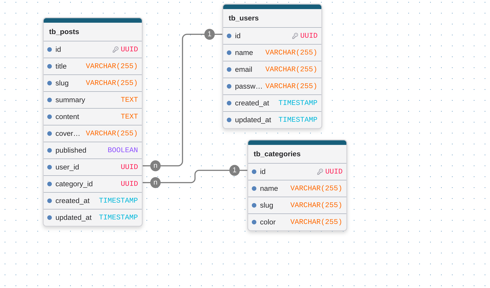

# Modelagem de Dados

Para o MVP, a estrutura relacional do banco de dados será enxuta, focando nas entidades de **Usuário (Admin)**, **Artigo** e **Categoria/Tag** (opcional, mas recomendada para organização técnica).

## 1. Entidade: `users` (Administrador)

Armazena as credenciais do autor do blog.

* `id` (UUID) — Chave Primária
* `name` (VARCHAR) — Nome do autor
* `email` (VARCHAR, Unique) — E-mail de login
* `password_hash` (VARCHAR) — Senha criptografada (bcrypt)
* `role` (VARCHAR) - Papel do usuário
* `created_at` (TIMESTAMP)
* `updated_at` (TIMESTAMP)

## 2. Entidade: `posts` (Artigos)

Armazena o conteúdo das postagens do blog.

* `id` (UUID) — Chave Primária
* `title` (VARCHAR) — Título do artigo
* `slug` (VARCHAR, Unique) — Identificador amigável para URL (ex: `introducao-ao-go`)
* `summary` (TEXT) — Breve resumo/subtítulo para exibição na listagem
* `content` (TEXT) — Conteúdo completo do artigo (pode armazenar Markdown ou HTML rico)
* `cover_image_url` (VARCHAR, Nullable) — URL da imagem de capa armazenada no **AWS S3**
* `published` (BOOLEAN) — Status para indicar se está publicado (`true`) ou rascunho (`false`)
* `user_id` (Chave Estrangeira para `tb_users.id`)
* `category_id` (Chave Estrangeira para `tb_categories.id`)
* `created_at` (TIMESTAMP)
* `updated_at` (TIMESTAMP)

## 3. Entidade `categories` (Categorias)

Armazena informação das categorias dos artigos

* `id` (UUID) - Chave Primária
* `name` (VARCHAR) - Nome da categoria
* `slug` (VARCHAR) - Slug da categoria
* `color` (VARCHAR) - Cor da categoria